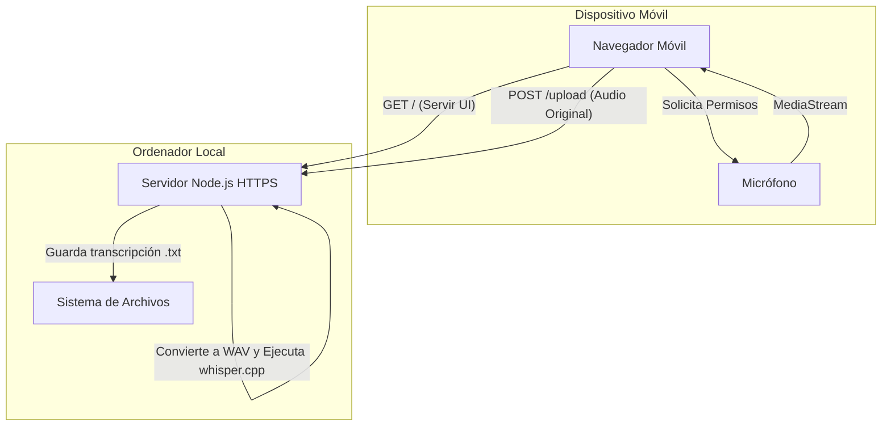

# Arquitectura: Aplicación de Grabación y Transcripción de Audio Local

## Descripción General
La solución sigue una arquitectura Cliente-Servidor adaptada para funcionar sobre una red local (LAN). El requisito principal establece que la aplicación correrá en Node.js de forma local, mientras que el usuario grabará audio desde el micrófono de su móvil Android (iPhone queda excluido del scope). Tras grabar el audio, el dispositivo lo enviará al servidor, donde se procesará localmente y de forma privada empleando `whisper.cpp` para generar y guardar una transcripción en formato `.txt`. Por lo tanto, el cliente será una aplicación web accesible a través del navegador de dicho dispositivo.

## Componentes Principales

### 1. Servidor Node.js Local (Backend)
- **Tecnología**: Node.js utilizando Express (u otro framework ligero).
- **Responsabilidades**:
  - Servir la aplicación web (archivos estáticos: HTML, CSS, JavaScript) al cliente móvil Android.
  - Recibir el archivo completo de audio a través de una API REST y guardarlo temporalmente.
  - Transcodificar el audio extraído a 16kHz WAV usando `ffmpeg` (formato necesario para Whisper).
  - Ejecutar un subproceso llamando al ejecutable local de `whisper.cpp` sobre el archivo WAV temporal.
  - Almacenar el texto resultante de la transcripción en el sistema de archivos local en formato `.txt`.
  - Proveer un **contexto seguro (HTTPS)**. Esto es fundamental, ya que los navegadores móviles bloquean el acceso al micrófono (`getUserMedia`) si la página no se sirve sobre HTTPS u origen de `localhost`. Al no ser `localhost` desde la perspectiva del móvil, se requiere HTTPS.

### 2. Cliente Web Móvil (Frontend)
- **Tecnología**: HTML5, JS Vanilla y CSS.
- **Responsabilidades**:
  - Renderizar una interfaz sencilla e intuitiva con dos botones principales: Iniciar y Detener Grabación.
  - Solicitar y gestionar los permisos de uso del micrófono mediante la API `navigator.mediaDevices.getUserMedia`.
  - Capturar el flujo de audio utilizando la API `MediaRecorder` preferiblemente con el tipo de medio `audio/ogg; codecs=opus`.
  - Enviar el archivo generado al servidor Node.js empleando `fetch` y `FormData`.

## Diagrama del Sistema

